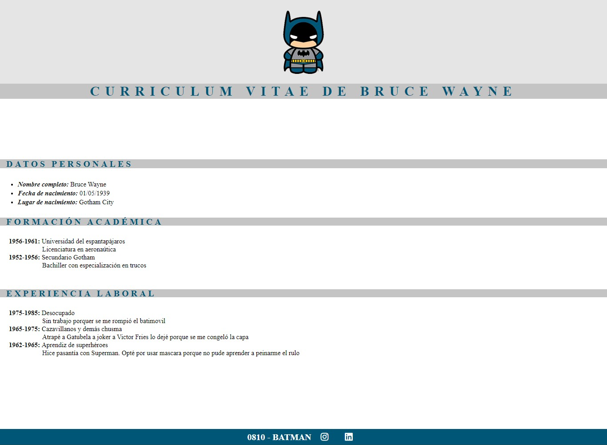

# Frontend I Assignment

This is a solution to one [Frontend assigment in Certified Tech Developer Career](https://www.figma.com/file/VfoIoqXwXUo5Gddw9h5M5I/Clase-07----Intro-a-CSS?node-id=0%3A1). Frontend challenges help me improve my coding skills by building realistic projects. 

## Table of contents

  - [The challenge](#the-challenge)
  - [Links](#links)
  - [Built with](#built-with)
  - [Continued development](#continued-development)

## Overview

### The challenge

Users should be able to:

- Build the CV according to figma design

### Screenshot

### Links

- [Live demo](https://jeraldinnemg.github.io/intro-css/)

## My process

### Built with

- Semantic HTML5 markup
- CSS custom properties

### Continued development

I'm a junior exploring technologies so I think there are a lot of ways to get the result! 
PD: Feel free to make suggestions!

